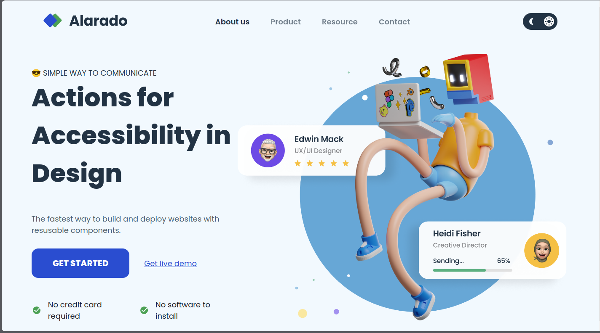
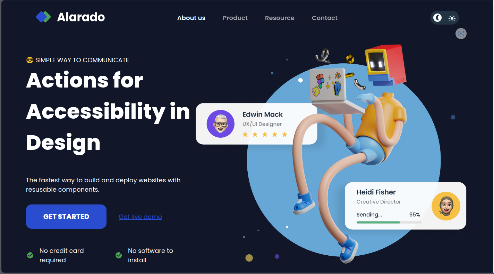
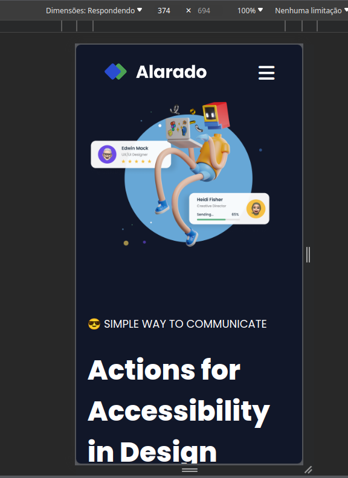

# Simple-Homepage---Alarado

Gostei muito de criar esta landing page responsiva porque pude colocar em prática a implementação de barras de navegação (navbars), barras laterais (sidebars) e menu hamburguer. Além disso, a mudança entre temas claro e escuro foi especialmente divertida de desenvolver!

#### Desafio feito com:

* HTML Semântico
* Vanilla JS